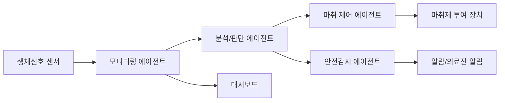

### 💉 폐루프 자율 마취 제어 안전감시 플랫폼 (다중 에이전트 사용)

<sub>Closed-loop Autonomous Anesthesia Control & Safety Monitoring Platform (Multi-Agent System)</sub>

<br>


</div>

---

## 📌 프로젝트 소개

[#-프로젝트-소개](#-프로젝트-소개)

**AI-Addict**는 수술 중 환자의 생체 신호를 실시간으로 분석하여
마취 심도를 자동으로 제어하고, 이상 징후를 감시하는 **다중 에이전트 기반 폐루프(closed-loop) 안전감시 플랫폼**입니다.

각 에이전트가 생체신호 분석 · 마취제 투여 제어 · 이상 상황 감시 · 알람 및 의사결정 지원 역할을 분담하여,
보다 정밀하고 안전한 마취 관리 워크플로우를 목표로 합니다.

---

## ✨ 주요 기능

[#-주요-기능](#-주요-기능)

- 🩺 **실시간 생체신호 모니터링** — 심박수, 혈압, BIS 지수 등 다중 센서 데이터 수집·분석
- 🤖 **다중 에이전트 협업 제어** — 역할별 에이전트가 상호 통신하며 투여량 의사결정
- 🔁 **폐루프 자동 제어(Closed-loop Control)** — 목표 마취 심도 유지를 위한 자동 피드백 제어
- 🚨 **이상 징후 감지 및 알람** — 임계값 이탈 시 즉각적인 경고 및 안전 개입
- 📊 **대시보드 시각화** — 수술진을 위한 실시간 상태 모니터링 화면

---

## 🧠 시스템 아키텍처

[#-시스템-아키텍처](#-시스템-아키텍처)



> 실제 에이전트 구성과 데이터 흐름에 맞게 다이어그램을 수정해 주세요.

---

## 🛠 기술 스택

[#-기술-스택](#-기술-스택)

| 구분 | 기술 |
|------|------|
| 언어 | Python |
| 에이전트 프레임워크 | (예: LangGraph / AutoGen / CrewAI 등) |
| 데이터 처리 | (예: Pandas, NumPy) |
| 시각화 | (예: Streamlit, Plotly) |
| 배포/환경 | (예: Docker) |

---


## 📁 프로젝트 구조

[#-프로젝트-구조](#-프로젝트-구조)

```
AI-Addict/
├── agents/          # 다중 에이전트 모듈
├── data/            # 생체신호 데이터
├── dashboard/        # 모니터링 대시보드
├── docs/            # 문서 및 다이어그램
└── README.md
```

---

## 👥 팀원

[#-팀원](#-팀원)

| 이름 | 학번 | GitHub |
|------|------|--------|
| 김민혁 | 236150 | [@아이디](https://github.com/) |
| 류광민 | 236150 | [@아이디](https://github.com/) |
| 이민준 | 23615036 | [@아이디](https://github.com/) |
| 이준용 | 25615036 | [@아이디](https://github.com/) |