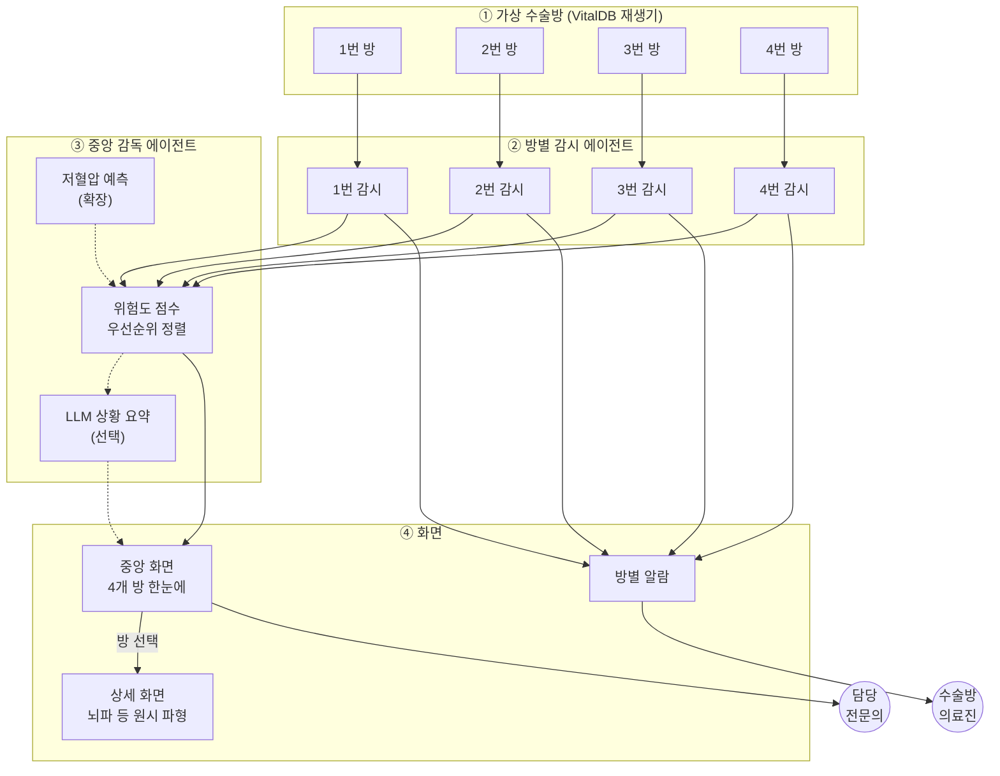

# 💉 AI-Addict: 다중 수술방 마취 안전감시 플랫폼

<sub>Multi-Operating-Room Anesthesia Safety Monitoring Platform (Multi-Agent System)</sub>

> ⚠️ 본 프로젝트는 공개 데이터셋 기반의 **연구·교육용 시뮬레이션**입니다. 실제 임상 환경에서 사용할 수 없으며, 의료진의 판단이나 마취 행위를 대신하지 않습니다.

---

## 📌 프로젝트 소개

국내 대형 병원에서는 수술 건수와 고위험 수술이 늘어나는 반면, 수술실에서 마취를 담당하는 전문의 인력은 부족한 상황입니다.
그 결과 마취과 전문의 한 명이 여러 수술방을 함께 책임지는 경우가 생기고, 모든 방의 모니터를 동시에 지켜볼 수 없기 때문에 이상 징후를 늦게 발견할 위험이 있습니다.

**AI-Addict**는 이 문제를 돕기 위한 **다중 에이전트 기반 안전감시 플랫폼**입니다.
수술방마다 배치된 감시 에이전트가 생체신호를 실시간으로 분석하고, 중앙 감독 에이전트가 모든 방의 상태를 모아
**"지금 의사가 직접 확인해야 하는 방이 어디인지"** 를 위험도 순으로 알려줍니다.

> 이 시스템은 의사를 줄이기 위한 도구가 아니라, **이미 과부하인 의사가 놓치는 순간을 줄이기 위한 도구**입니다.
> 모든 의학적 판단과 처치는 의사가 직접 합니다.

실제 수술방 대신 서울대학교병원 공개 데이터셋 **VitalDB**의 수술 기록을 재생하여 **가상 수술방 4개**를 구성하고 시연합니다.

---

## 🙋 누가 사용하나요?

| 사용자 | 보는 화면 | 받는 정보 |
|--------|----------|----------|
| **담당 마취과 전문의** | 중앙 화면 | 4개 방 전체의 위험도 순위, 직접 개입이 필요한 방 |
| **각 수술방 의료진** | 방별 화면 | 자기 방의 알람과 상세 신호 |

---

## ✨ 주요 기능

- 🏥 **가상 수술방 재생** — VitalDB 수술 기록 4건을 동시에 재생, 배속·시작 지점 조절
- 🩺 **방별 실시간 감시** — BIS·SQI(신호 품질), 평균동맥압(MAP), 심박수(HR), 산소포화도(SpO2) 분석
- 🚨 **이상 징후 알람** — 기준치 이탈 시 경고, 일정 시간 지속 조건과 신호 품질 확인으로 순간 잡음·센서 문제에 의한 가짜 알람 감소
- 📊 **위험도 우선순위** — 4개 방의 위험도를 점수화하여 "먼저 확인할 방" 순으로 정렬
- 🖥️ **2단계 화면**
  - 중앙 화면: 4개 방의 핵심 수치와 위험도를 한눈에 표시
  - 상세 화면: 방 선택 시 원래 뇌파와 델타·알파·베타 성분, 심전도·동맥압·맥파·호흡 파형 등 모든 신호 표시 → BIS 수치가 믿을 만한지 확인 가능
- 💬 **상황 요약 (선택)** — LLM이 각 방의 상태를 읽기 쉬운 문장으로 요약
- 📈 **저혈압 조기 예측 (확장)** — 수 분 뒤 저혈압 발생 가능성 예측
- 🔁 **폐루프 제어 시뮬레이션 (확장)** — 약동학(PK/PD) 가상 환자 모델 기반 마취 심도 유지 실험

---

## 🧠 시스템 아키텍처


```mermaid
flowchart TB
    subgraph L1["① 가상 수술방 (VitalDB 재생기)"]
        direction LR
        R1["1번 방"]
        R2["2번 방"]
        R3["3번 방"]
        R4["4번 방"]
    end

    subgraph L2["② 방별 감시 에이전트"]
        direction LR
        A1["1번 감시"]
        A2["2번 감시"]
        A3["3번 감시"]
        A4["4번 감시"]
    end

    subgraph L3["③ 중앙 감독 에이전트"]
        direction LR
        P["저혈압 예측<br/>(확장)"]
        S["위험도 점수<br/>우선순위 정렬"]
        L["LLM 상황 요약<br/>(선택)"]
    end

    subgraph L4["④ 화면"]
        direction LR
        RA["방별 알람"]
        D["중앙 화면<br/>4개 방 한눈에"]
        DD["상세 화면<br/>뇌파 등 원시 파형"]
    end

    N(("수술방<br/>의료진"))
    M(("담당<br/>전문의"))

    R1 --> A1
    R2 --> A2
    R3 --> A3
    R4 --> A4

    A1 & A2 & A3 & A4 --> S
    A1 & A2 & A3 & A4 --> RA
    P -.-> S
    S -.-> L

    S --> D
    L -.-> D
    D -- "방 선택" --> DD

    RA --> N
    D --> M
```

| 계층 | 하는 일 | 상태 |
|------|--------|------|
| ① 가상 수술방 | VitalDB 수술 기록 4건을 동시에 재생 (배속·시작 지점 조절) | 완료 |
| ② 방별 감시 에이전트 | 각 방의 신호를 규칙 기반으로 분석, 이상 징후 판정 | 다음 단계 |
| ③ 중앙 감독 에이전트 | 4개 방의 위험도를 점수화해 우선순위 정렬, 필요 시 예측·요약 추가 | 예정 |
| ④ 화면 | 방 안 의료진에게는 그 방의 알람, 담당 전문의에게는 전체 우선순위 표시 | 확인 화면 완료 |

- 실선: 기본 구현 범위 / 점선: 선택 또는 확장
- 최종 판단과 처치는 항상 사람(동그라미)이 합니다.

### 설계 원칙

1. **알람 판정과 안전 기준은 규칙 기반으로 고정합니다.** AI(예측 모델, LLM)는 판단을 보조할 뿐 결정하지 않습니다.
2. **투약·처치 결정은 시스템의 범위가 아닙니다.** 시스템은 "어디를 봐야 하는지"까지만 알려줍니다.
3. **에이전트는 파이썬 클래스 간 메시지 전달 구조**로 단순하게 구현합니다.
4. **각 수술방 모니터의 즉시 경보는 그대로 둡니다.** 이 시스템은 그 위에서 여러 방의 순위를 매기는 보조 계층입니다.

---

## 🚀 빠르게 시작하기

```bash
pip install -r requirements.txt

# 1) 시연 케이스 데이터 받기 (약 195MB, cases/ 폴더에 저장, 저장소에는 올라가지 않음)
python data/scripts/6_download_cases.py

# 2) 재생기 검증 (시연 타임라인이 docs/DECISIONS.md D-07 표와 같으면 정상)
python -m replay.test_replay

# 3) 확인 화면 만들기 → replay/viewer.html 을 브라우저로 열기
python -m replay.export_viewer
```

재생기 사용법:

```python
from replay.replayer import Replayer
rp = Replayer.from_csv('data/selected_cases.csv', data_dir='cases')
frames = rp.tick()                 # 1초 전진, {'OR-1': Frame, ...}
frames['OR-3'].num['map']          # 평균동맥압
frames['OR-3'].wave['art']         # 이번 1초의 동맥압 파형 500개
```

---

## 🛠 기술 스택

| 구분 | 기술 |
|------|------|
| 언어 | Python |
| 데이터 | VitalDB (`vitaldb` 패키지), Pandas, NumPy, SciPy, PyArrow |
| 에이전트 | Python 클래스 기반 자체 구현 |
| 화면 | Streamlit, Plotly (확인 화면은 HTML + JavaScript) |
| 예측 모델 (확장) | scikit-learn 또는 LightGBM |
| 상황 요약 (선택) | LLM API |

---

## 📁 프로젝트 구조

```
AI-Addict/
├── data/
│   ├── selected_cases.csv    # 시연 케이스 4건 + 예비 2건, 방 배정과 시작 지점
│   ├── events_shortlist.csv  # 유형별 후보 케이스 31건
│   └── scripts/              # 케이스 선정·다운로드 스크립트 (1~6번 순서)
├── replay/                   # 가상 수술방 재생기, 검증 스크립트, 확인 화면 생성기
├── agents/                   # 방별 감시 에이전트, 중앙 감독 에이전트
├── dashboard/                # 중앙 화면, 방별 상세 화면
├── docs/                     # 설계 결정 기록, 인수인계 메모, 보고서 자료
│   └── DECISIONS.md
├── requirements.txt
└── README.md
```

실제 데이터 파일(`cases/`)은 팀 드라이브에 공유합니다.

---

## 🎬 시연 시나리오

| 방 | 케이스 성격 | 시연에서 보여줄 것 |
|----|------------|------------------|
| 1번 | 안정 (동맥압 순간 튐) | 순간 잡음은 걸러내고 초록 유지 |
| 2번 | 안정 (BIS 순간 0) | 센서 문제로 판정해 경보 억제, 원래 뇌파는 정상임을 확인 |
| 3번 | 수술 중 저혈압 발생 | 알람 발생, 우선순위 1위로 상승 |
| 4번 | BIS 목표 범위 이탈 | 다른 종류의 위험 감지, 3번 방 회복 후 1위로 교체 |

3번과 4번 방의 이상 징후가 **서로 다른 시점**에 발생하도록 재생 시작 지점을 맞춰,
시연 도중 **"의사가 먼저 가야 할 방"이 바뀌는 장면**을 보여줍니다. 자세한 타임라인은 `docs/DECISIONS.md` D-07 참고.

---

## 🔍 관련 연구와 차별점

| 기존 사례 | 내용 | 본 프로젝트와의 차이 |
|----------|------|-------------------|
| Anesthesiology Control Tower (미국 세인트루이스 워싱턴대, WashU) | 수술실 밖 의료진이 여러 수술실을 원격 감시하는 관제탑 | 사람이 전체를 감시하는 구조 → 본 프로젝트는 에이전트가 **우선순위를 먼저 정리** |
| Acumen HPI (Edwards) | 동맥압 파형 기반 저혈압 예측 상용 소프트웨어 | 단일 환자 대상, 특정 장비 필요 → 본 프로젝트는 **다중 수술방 통합**, 공개 데이터로 재현 가능 |
| 서울아산병원 저혈압 예측 AI (IEEE TNNLS, 2023) | 판단 근거를 함께 제공하는 저혈압 예측 모델 | 예측 모델 연구 → 본 프로젝트는 **여러 방을 묶는 감독 흐름**에 초점 |

자세한 출처는 [`docs/DECISIONS.md`](docs/DECISIONS.md) 참고

---

## 📅 일정

- 최종 시연·발표: **2026년 12월 (학기 말)**
- 결정 사항·개발 단계·작업 규칙: [`docs/DECISIONS.md`](docs/DECISIONS.md)

---

## 👥 팀원

| 이름 | GitHub |
|------|--------|
| 김민혁 | [rlaalsgur187](https://github.com/rlaalsgur187) |
| 류광민 | [ssy9884-ux](https://github.com/ssy9884-ux) |
| 이민준 | [MANBI049](https://github.com/MANBI049) |
| 이준용 | [leejunyong06](https://github.com/leejunyong06) |

---

## 📚 데이터 출처

- VitalDB — 서울대학교병원 공개 수술 중 생체신호 데이터셋 (https://vitaldb.net)
- 데이터 이용 시 VitalDB 이용 약관을 따릅니다.
